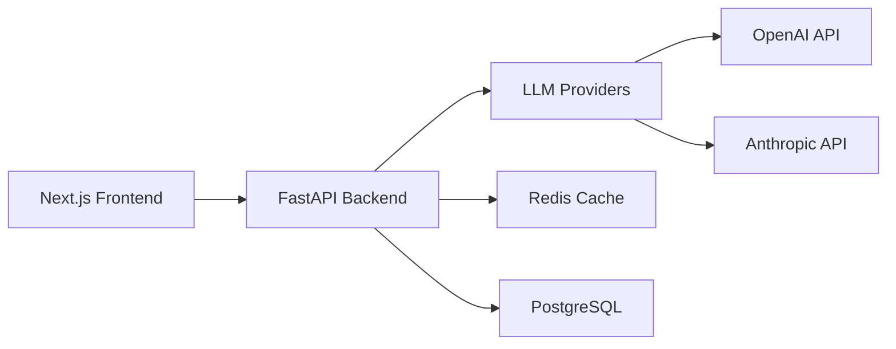

# 🤖 AI Chatbot Demo

A production-ready AI chatbot system with support for multiple LLM providers, intelligent caching, and real-time streaming.


## ✨ Features

- **🔄 Multi-Provider Support** - Seamlessly switch between OpenAI and Anthropic models
- **💾 Intelligent Caching** - Redis-powered semantic cache for faster responses
- **🔌 Real-time Streaming** - WebSocket support for streaming responses
- **📊 Production Ready** - Health checks, monitoring, and rate limiting
- **🎨 Modern UI** - Clean React/Next.js interface
- **📚 Interactive Docs** - Swagger UI for API exploration
- **🔒 Secure by Default** - API key authentication and rate limiting

## 🚀 Quick Start (5 Minutes)

### Prerequisites

- Docker & Docker Compose installed
- At least one API key (OpenAI or Anthropic)

### 1️⃣ Clone the Repository

```bash
git clone <repository-url>
cd ai-chatbot-system
```

### 2️⃣ Configure API Keys

```bash
cp backend/.env.example backend/.env
```

Edit `backend/.env` and add your API key(s):
```env
OPENAI_API_KEY=sk-your-openai-key-here
ANTHROPIC_API_KEY=sk-your-anthropic-key-here  # Optional
```

**Get your API keys:**
- OpenAI: [https://platform.openai.com/api-keys](https://platform.openai.com/api-keys)
- Anthropic: [https://console.anthropic.com/account/keys](https://console.anthropic.com/account/keys)

### 3️⃣ Run the Demo

```bash
./setup_demo.sh
```

The script will:
- Validate your configuration
- Build Docker containers
- Start all services
- Verify everything is working

### 4️⃣ Access Your Demo

- **💬 Chat UI:** [http://localhost:3000](http://localhost:3000)
- **📚 API Docs:** [http://localhost:8000/docs](http://localhost:8000/docs)
- **🔧 API Endpoint:** [http://localhost:8000](http://localhost:8000)

## 📖 API Usage Examples

### Basic Chat Request

```bash
curl -X POST http://localhost:8000/api/chat \
  -H "Content-Type: application/json" \
  -d '{
    "message": "What is the capital of France?",
    "model": "gpt-3.5-turbo"
  }'
```

### Streaming Response (WebSocket)

```javascript
const ws = new WebSocket('ws://localhost:8000/ws/chat');

ws.onopen = () => {
  ws.send(JSON.stringify({
    message: "Tell me a story",
    stream: true
  }));
};

ws.onmessage = (event) => {
  const data = JSON.parse(event.data);
  console.log('Received:', data.content);
};
```

### Check Available Models

```bash
curl http://localhost:8000/api/models
```

### System Status

```bash
curl http://localhost:8000/api/demo/status
```

## 🏗️ Architecture



### Components

| Component | Technology | Purpose |
|-----------|------------|---------|
| **Frontend** | Next.js/React | User interface |
| **Backend** | FastAPI/Python | API server |
| **Cache** | Redis | Response caching |
| **Database** | PostgreSQL | Conversation storage |
| **Proxy** | Nginx (optional) | Load balancing |

## ⚙️ Configuration

All configuration is in `backend/.env`:

| Variable | Required | Description | Default |
|----------|----------|-------------|---------|
| `OPENAI_API_KEY` | Yes* | OpenAI API key | - |
| `ANTHROPIC_API_KEY` | Yes* | Anthropic API key | - |
| `DEFAULT_MODEL_PROVIDER` | No | Default provider | `openai` |
| `RATE_LIMIT_REQUESTS` | No | Requests per minute | `30` |
| `LOG_LEVEL` | No | Logging level | `INFO` |

*At least one API key is required

## 🛠️ Development

### Running Locally (Without Docker)

```bash
# Backend
cd backend
pip install -r requirements.demo.txt
uvicorn app.main_demo:app --reload

# Frontend
cd frontend
npm install
npm run dev
```

### Running Tests

```bash
# Backend tests
cd backend
pytest tests/

# Frontend tests
cd frontend
npm test
```

### Modifying the Code

The backend hot-reloads automatically when you modify files in `backend/app/`.

## 📊 Monitoring

### View Logs

```bash
# All services
docker-compose -f docker-compose.demo.yml logs -f

# Specific service
docker-compose -f docker-compose.demo.yml logs -f backend
```

### Health Checks

- Backend Health: `http://localhost:8000/api/health/ready`
- Frontend Health: `http://localhost:3000/api/health`

## 🐛 Troubleshooting

### Common Issues

#### "No API keys found"
- Ensure you've added at least one API key to `backend/.env`
- Keys should start with `sk-` for OpenAI or `sk-ant-` for Anthropic

#### "Port already in use"
- Change ports in `docker-compose.demo.yml`
- Or stop conflicting services: `lsof -i :8000` and `lsof -i :3000`

#### "Cannot connect to Docker"
- Ensure Docker Desktop is running
- On Linux: `sudo systemctl start docker`

#### "Out of memory"
- Reduce Redis memory in `docker-compose.demo.yml`
- Increase Docker memory allocation in Docker Desktop settings

### Reset Everything

```bash
# Stop and remove all containers
docker-compose -f docker-compose.demo.yml down -v

# Remove all data
docker system prune -a
```

## 🚀 Deployment

### Deploy to Cloud

The demo is ready for deployment to:

- **Heroku**: Use included `Procfile`
- **AWS ECS**: Use included Dockerfiles
- **Google Cloud Run**: Deploy containers directly
- **Azure Container Instances**: Use docker-compose file

### Production Checklist

- [ ] Change `JWT_SECRET` in `.env`
- [ ] Set up proper database (not SQLite)
- [ ] Configure HTTPS/SSL
- [ ] Set up monitoring (Prometheus/Grafana)
- [ ] Configure backup strategy
- [ ] Implement proper logging
- [ ] Set up CI/CD pipeline

## 📝 API Documentation

Full API documentation is available at `http://localhost:8000/docs` when the demo is running.

### Key Endpoints

| Method | Endpoint | Description |
|--------|----------|-------------|
| GET | `/` | API info and status |
| GET | `/api/models` | List available models |
| POST | `/api/chat` | Send chat message |
| WS | `/ws/chat` | WebSocket chat |
| GET | `/api/health/ready` | Health check |
| GET | `/api/demo/status` | Demo status |

## 🤝 Contributing

Contributions are welcome! Please feel free to submit a Pull Request.

1. Fork the repository
2. Create your feature branch (`git checkout -b feature/AmazingFeature`)
3. Commit your changes (`git commit -m 'Add some AmazingFeature'`)
4. Push to the branch (`git push origin feature/AmazingFeature`)
5. Open a Pull Request

## 📜 License

This project is licensed under the MIT License - see the [LICENSE](LICENSE) file for details.

## 🙏 Acknowledgments

- OpenAI for GPT models
- Anthropic for Claude models
- FastAPI for the excellent web framework
- Next.js for the frontend framework

## 📧 Support

For issues and questions:
- Create an issue on GitHub
- Check existing issues for solutions
- Review the troubleshooting section above

---

**Built with ❤️ for the AI community**